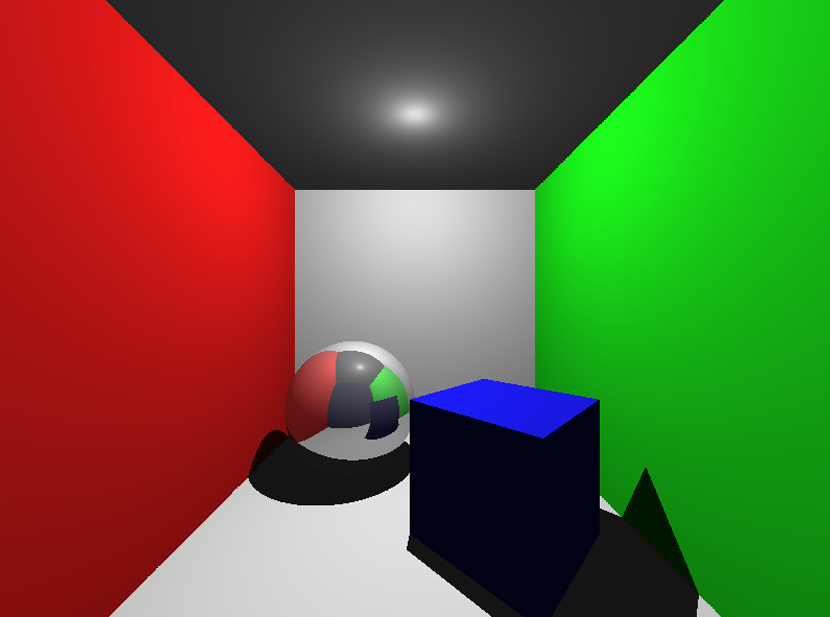

# Ray Tracer — PAP Project

> Implementation of a Ray Tracing rendering engine in C++ with shadow handling, reflections, and SDL2 display.

  

**Authors:** Bilâl Jaiel & Kalaivaasan Balakumar

---

## Rendered Output



*Cornell Box scene (800×600): reflective sphere, oriented blue cube, hard shadows, and recursive mirror reflections — all computed via ray tracing.*

---

## Features

- **Ray-object intersection** — Spheres, axis-aligned quads, and arbitrarily oriented cubes
- **Lambertian diffuse shading** — `I = I_source × max(0, N·L)`
- **Hard shadows** — Shadow ray cast from each hit point toward the point light; ambient-only fallback in shadow areas
- **Recursive mirror reflections** — Up to 5 bounces using the formula `R = D - 2(D·N)N`
- **Shadow acne prevention** — Origins of secondary rays offset by `ε = 1e-4` along the surface normal
- **Cornell Box scene** — Closed 10×10×10 room with coloured walls, a mirror sphere, and a rotated blue cube
- **PPM export** — Rendered frame saved to `rendu_final.ppm`
- **SDL2 live display** — Result shown in a window after computation
- **No external math library** — All vector math (`Vector3f`) implemented from scratch; Rodrigues' rotation formula used instead of 4×4 matrices

---

## Architecture

The project follows a strict object-oriented design. All geometry inherits from an abstract `Shape` base class, allowing the `Scene` to handle spheres, quads, and cubes polymorphically.

```
.
├── include/
│   ├── vector3f.h      # 3D vector math (dot, cross, normalize, Hadamard…)
│   ├── ray3f.h         # Parametric ray  P(t) = O + t·D
│   ├── camera.h        # Perspective camera — pre-computed orthonormal basis (Right, Up, Forward)
│   ├── material.h      # RGB colour [0,1] + shininess/reflectivity coefficient
│   ├── hit_info.h      # Intersection record: distance, point, normal, material
│   ├── shape.h         # Abstract base class — virtual is_hit() + reflect()
│   ├── sphere.h        # Sphere via analytic quadratic intersection
│   ├── quad.h          # Bounded planar quad (origin + width + height vectors)
│   ├── cube.h          # Oriented cube — Composite of 6 Quads + Rodrigues rotation
│   ├── scene.h         # Scene graph: traceRay / calculateLighting / render loop
│   └── sdl_helper.h    # SDL2 window & pixel buffer display
│
└── src/
    ├── vector3f.cpp
    ├── ray3f.cpp
    ├── camera.cpp
    ├── material.cpp
    ├── shape.cpp
    ├── sphere.cpp
    ├── quad.cpp
    ├── cube.cpp
    ├── scene.cpp
    ├── sdl_helper.cpp
    └── main.cpp        # Scene setup entry point
```

---

## Dependencies

| Library | Version | Purpose |
|---------|---------|---------|
| SDL2 | 2.x | Window creation & pixel rendering |
| MinGW / g++ | ≥ 9 | C++ compiler (Windows) |

> On Linux/macOS, replace `-lmingw32 -lSDL2main -lSDL2` with `$(pkg-config --cflags --libs sdl2)`.

---

## Build & Run

Place yourself inside the `src/` directory, then run:

```bash
# Windows (MinGW)
g++ -g -Wall -Wextra -I../include -o prog *.cpp -lmingw32 -lSDL2main -lSDL2

# Linux / macOS
g++ -g -Wall -Wextra -I../include -o prog *.cpp $(pkg-config --cflags --libs sdl2)

./prog
```

The renderer prints progress to stdout, saves `rendu_final.ppm` in the working directory, and opens an SDL2 window. Close the window to exit.

---

## Rendering Pipeline

```
For each pixel (x, y):
  1. Normalised screen coordinates  (u, v) ∈ [-1, 1]
  2. Camera::getRay(u, v, aspectRatio)  →  Ray3f
       └─ aspect ratio applied to avoid image distortion
  3. Scene::traceRay(ray, depth = 5)
       ├─ Find closest intersection across all shapes
       ├─ No hit  →  return background colour (dark blue)
       ├─ Scene::calculateLighting(hit)
       │     ├─ Ambient term  (always applied)
       │     ├─ isInShadow()  →  shadow ray toward light
       │     └─ Lambertian diffuse  max(0, N·L)
       └─ shininess > 0  →  recursive reflected ray (depth - 1)
  4. Clamp to [0, 1]  →  store in imageBuffer
```

The camera's orthonormal basis `(Right, Up, Forward)` is pre-computed once in the constructor — avoiding 480 000 redundant cross-product calculations at 800×600 resolution.

---

## Geometry

**Sphere** — Defined by centre + radius. Intersection solved via the quadratic equation `‖P(t) − C‖² = R²`; the surface normal is the unit vector from centre to hit point.

**Quad** — Defined by a centre (`origin`), a `width` vector, and a `height` vector. After intersecting the infinite plane, local coordinates are computed by dot-product projection:

```
u = (V·Width)  / ‖Width‖²       v = (V·Height) / ‖Height‖²
```

The hit is valid if and only if `|u| ≤ 0.5` and `|v| ≤ 0.5`.

**Cube** — Implemented as a *Composite* of 6 `Quad` faces (DRY principle — reuses the proven quad intersection rather than re-implementing OBB intersection). An orthonormal local basis `(X, Y, Z)` is computed from the two orientation vectors via Gram-Schmidt projection. Arbitrary rotation is handled using **Rodrigues' rotation formula** — chosen over 4×4 matrices to avoid implementing a full matrix class without external libraries:

```
v_rot = v·cosθ + (k × v)·sinθ + k·(k·v)·(1 − cosθ)
```

---

## Scene Overview

The default scene (`main.cpp`) constructs a **Cornell Box** (10×10×10 units):

| Object | Type | Material |
|--------|------|----------|
| Floor | Quad | Neutral white (matte) |
| Ceiling | Quad | Neutral white (matte) |
| Back wall | Quad | Neutral white (matte) |
| Left wall | Quad | Red (matte) |
| Right wall | Quad | Green (matte) |
| Sphere | Sphere r=2 | Mirror (shininess 0.6) |
| Cube | Oriented Cube | Matte blue |

Point light at `(0, 4.5, 0)` — just below the ceiling, casting hard shadows downward.

---

## Technical Challenges & Solutions

**Shadow Acne** — Floating-point rounding caused secondary rays to self-intersect at their origin. Fixed by offsetting the ray origin by `ε = 1e-4` along the surface normal before casting shadow or reflection rays.

**Camera orientation** — Correct distortion-free projection achieved by pre-computing a local orthonormal frame `(Right, Up, Forward)` via successive cross products in the `Camera` constructor.

**Memory management** — All shapes are stored as raw `Shape*` pointers. The `Scene` destructor iterates over the vector and calls `delete` on each pointer. The `Cube` destructor similarly frees its 6 `Quad` faces, preventing memory leaks.

---

## Extending the Scene

```cpp
// Sphere
scene.addShape(new Sphere(1.5f, Vector3f(0.0f, -3.5f, 0.0f), matMirror));

// Quad (wall, floor, ceiling…)
scene.addShape(new Quad(origin, widthVec, heightVec, material));

// Oriented cube — explicit axis vectors
scene.addShape(new Cube(center, size, mat, forwardVec, upVec));

// Oriented cube — camera-relative pitch/yaw rotations (radians)
scene.addShape(new Cube(center, size, mat, cam.getDirection(), pitchRad, yawRad));
```

`Material(r, g, b, shininess)` — all values in `[0, 1]`. `shininess = 0` → fully diffuse; `shininess = 1` → perfect mirror.

---

## Known Limitations & Future Work

- No anti-aliasing (single ray per pixel)
- Point light only — no area lights or soft shadows
- No texture support
- No acceleration structure (BVH) — intersection is O(n) per ray

Potential improvements: multi-sample anti-aliasing, BVH tree, texture mapping, and area lights for soft shadows.

---

## Authors

- **Bilâl Jaiel**
- **Kalaivaasan Balakumar**

*ENSIIE 2A — PAP Project, 2025/2026*
