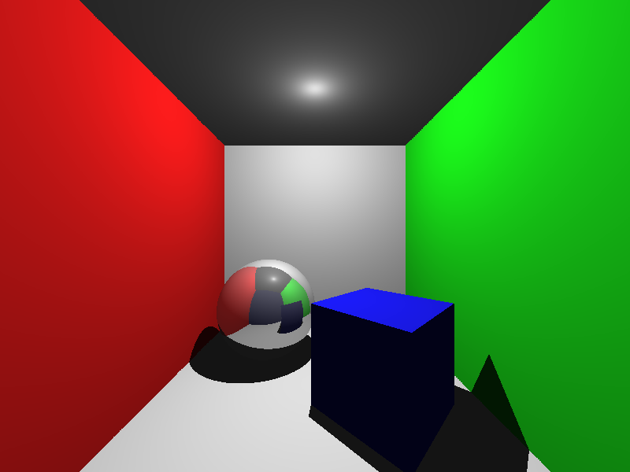

<div align="center">

# Ray Tracer in C++

A ray tracing engine written from scratch in C++17, with no graphics or linear-algebra library.<br>
Ray-object intersection, Lambertian shading, hard shadows and recursive mirror reflections.




<sub>Cornell Box, 800 × 600: mirror sphere, rotated cube, hard shadows and up to 5 reflection bounces.<br>This image is the exact output of the code in this repository.</sub>

</div>

<br>

| | |
|---|---|
| Context | Two-person project, *Programmation Avancée* course, ENSIIE (2nd year, 2025-2026) |
| Language | C++17, SDL2 for display only |
| Highlights | Polymorphic scene graph, Rodrigues rotations, recursive reflections, shadow-acne fix |

---

## Contents

- [Features](#features)
- [How it works](#how-it-works)
- [Build and run](#build-and-run)
- [Customising the scene](#customising-the-scene)
- [Limitations](#limitations)

---

## Features

| | |
|---|---|
| Primitives | Spheres, bounded planar quads, arbitrarily oriented cubes |
| Scene | Every primitive derives from an abstract `Shape` class, so the scene handles all objects uniformly |
| Shading | Lambertian diffuse `I = I_source · max(0, N·L)` plus a constant ambient term |
| Shadows | A shadow ray is cast from each hit point toward the point light |
| Reflections | `R = D − 2(D·N)N`, up to 5 bounces, blended with the local colour by the material's reflectivity |
| Robustness | Secondary rays start at `P + ε·N` with `ε = 1e-4` to avoid shadow acne |
| Orientation | Rodrigues' rotation formula instead of 4 × 4 matrices |
| Output | PPM file (`rendu_final.ppm`) and live SDL2 window |

## How it works

### Rendering loop

```
for each pixel (x, y):
  1. normalised screen coordinates (u, v) ∈ [-1, 1], corrected by the aspect ratio
  2. Camera::getRay(u, v)                 → primary ray
  3. Scene::traceRay(ray, depth = 5)
       ├─ closest intersection over all shapes (no hit → dark-blue background)
       ├─ lighting: ambient + shadow test + Lambertian diffuse
       └─ if reflective: recursive call on the reflected ray (depth − 1)
  4. clamp to [0, 1] → image buffer → PPM file + SDL window
```

### Geometry

- Sphere: solve `‖P(t) − C‖² = R²`; the normal is `(P − C) / R`.
- Quad: intersect the supporting plane, then project onto the local axes with `u = (V·W)/‖W‖²` and `v = (V·H)/‖H‖²`. The hit is valid if `|u| ≤ 0.5` and `|v| ≤ 0.5`.
- Cube: a composite of six `Quad` faces, which reuses the tested quad intersection instead of a separate oriented-box test. The local basis is orthonormalised with Gram-Schmidt and rotated with Rodrigues' formula, `v_rot = v·cosθ + (k × v)·sinθ + k·(k·v)·(1 − cosθ)`.

### Code layout

```
include/                 src/
├── vector3f.h           ├── vector3f.cpp     3D vector maths (dot, cross, normalise, Hadamard)
├── ray3f.h              ├── ray3f.cpp        parametric ray P(t) = O + t·D
├── camera.h             ├── camera.cpp       perspective camera, precomputed orthonormal basis
├── material.h           ├── material.cpp     RGB colour in [0, 1] and reflectivity
├── hit_info.h           │                    intersection record
├── shape.h              ├── shape.cpp        abstract base class
├── sphere.h             ├── sphere.cpp       analytic quadratic intersection
├── quad.h               ├── quad.cpp         bounded plane
├── cube.h               ├── cube.cpp         six quads and Rodrigues rotation
├── scene.h              ├── scene.cpp        traceRay, lighting, render loop
└── sdl_helper.h         ├── sdl_helper.cpp   SDL2 window and pixel buffer
                         └── main.cpp         scene definition (Cornell Box)
```

### Implementation notes

- Shadow acne: floating-point error made secondary rays hit their own surface. Offsetting their origin along the normal by `ε` removed the artefacts.
- Camera: the orthonormal frame is computed once in the constructor instead of for each of the 480,000 primary rays.
- Memory: shapes are owned by the `Scene` (raw `Shape*`) and released in its destructor; each `Cube` releases its six faces.

## Build and run

Requirements: a C++17 compiler (g++ 9 or later) and the SDL2 development files.

<details open>
<summary>Linux / macOS</summary>

```bash
# Debian/Ubuntu: sudo apt install libsdl2-dev      macOS: brew install sdl2
cd src
g++ -O2 -Wall -Wextra -I../include -o prog *.cpp $(pkg-config --cflags --libs sdl2)
./prog
```

</details>

<details>
<summary>Windows (MinGW)</summary>

```bash
cd src
g++ -O2 -Wall -Wextra -I../include -o prog.exe *.cpp -lmingw32 -lSDL2main -lSDL2
./prog.exe   # SDL2.dll must be next to the executable or on the PATH
```

</details>

The program prints its progress, writes `rendu_final.ppm` in the working directory, then opens an SDL2 window. Close the window to exit.

## Customising the scene

Scenes are defined in `src/main.cpp`:

```cpp
// Sphere: radius, centre, material
scene.addShape(new Sphere(1.5f, Vector3f(0.0f, -3.5f, 0.0f), matMirror));

// Quad: centre, width vector, height vector, material
scene.addShape(new Quad(origin, widthVec, heightVec, material));

// Cube: centre, edge length, material, forward and up orientation vectors
scene.addShape(new Cube(center, size, mat, forwardVec, upVec));
```

`Material(r, g, b, shininess)` takes values in `[0, 1]`. The fourth parameter is the reflection coefficient: `0` is fully diffuse, `1` a perfect mirror.

## Limitations

- One ray per pixel, hence aliased edges; multi-sample anti-aliasing would fix this.
- A single point light, hence hard shadows only; area lights would give soft shadows.
- No textures and no refraction.
- Every ray is tested against every shape; a bounding volume hierarchy would make larger scenes tractable.
- Ownership through raw pointers; `std::unique_ptr` would be the modern C++ choice.

---

<div align="center">
<sub>Bilâl Jaiel · Kalaivaasan Balakumar<br><a href="https://github.com/bilal-jaiel">GitHub</a> · <a href="https://www.linkedin.com/in/bilal-jaiel/">LinkedIn</a></sub>
</div>
